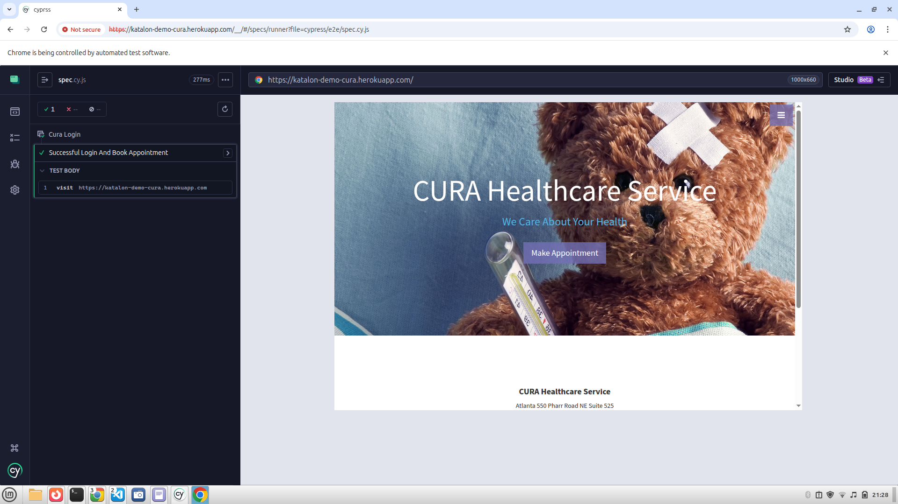
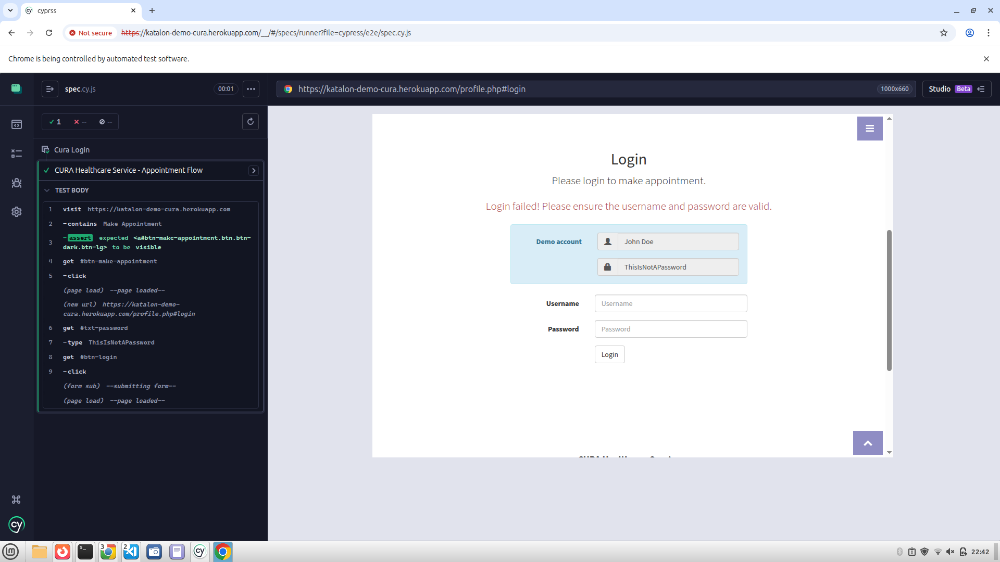
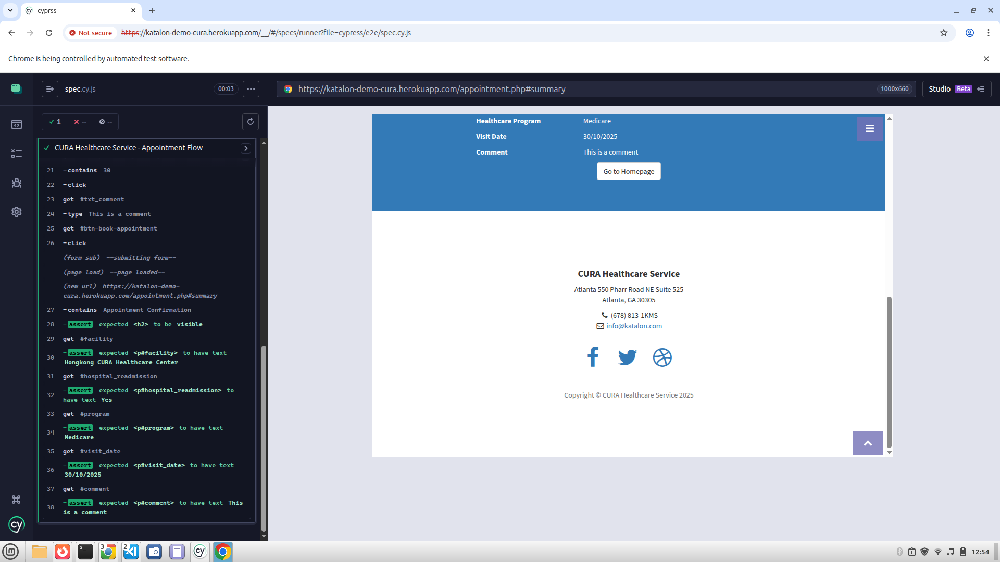
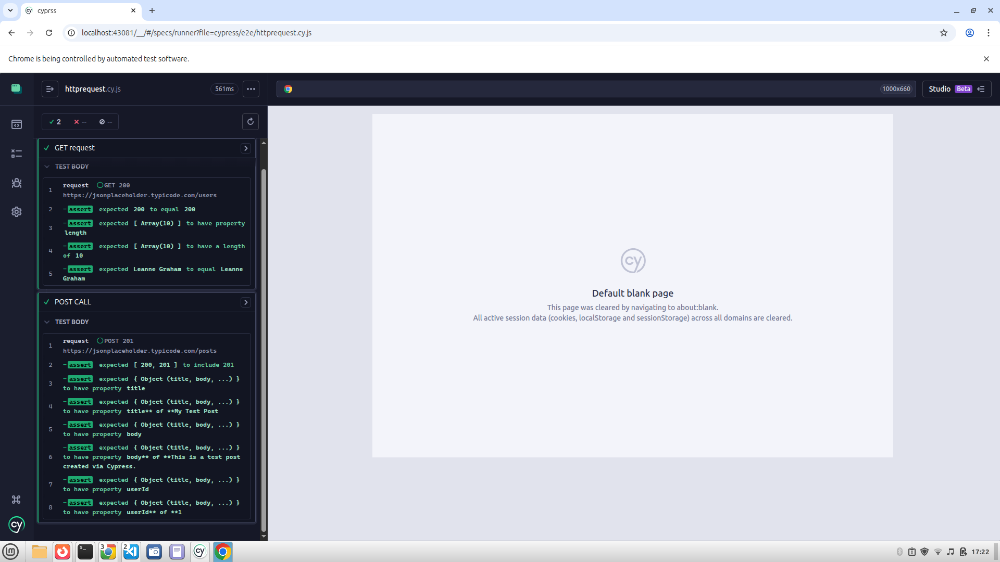

# Cypress Demo

This project is a demo to showcase my skills in automated testing using **Cypress**.  
It includes UI tests, custom commands, and a structured test framework that follows best practices for maintainability and scalability.

URL -> https://katalon-demo-cura.herokuapp.com/
## Tech Stack:

* | **Cypress** | End-to-end, component, and API testing |

## Getting Started
First and foremost, install your dependencies.

**  Make sure Node.js (version 16+) is installed.

1. ```sh
   git clone <this-repo-url>
   cd cypress-demo
   npm install
   ```
2. Create a new project
   ```sh
   npm init -y
    ```
3. Install Cypress
   ```sh
   npm i -D cypress
   ```
4. Open Cypress UI
   ```sh
   npx cypress open
   ```
5. Run Cypress Tests
   ```sh
   npx cypress run
   ```
Also check  Cypress Offical Notes 
[Follow these instructions to install Cypress.](https://on.cypress.io/guides/installing-and-running#section-installing)

## This image shows the interactive Cypress runner executing UI tests:




